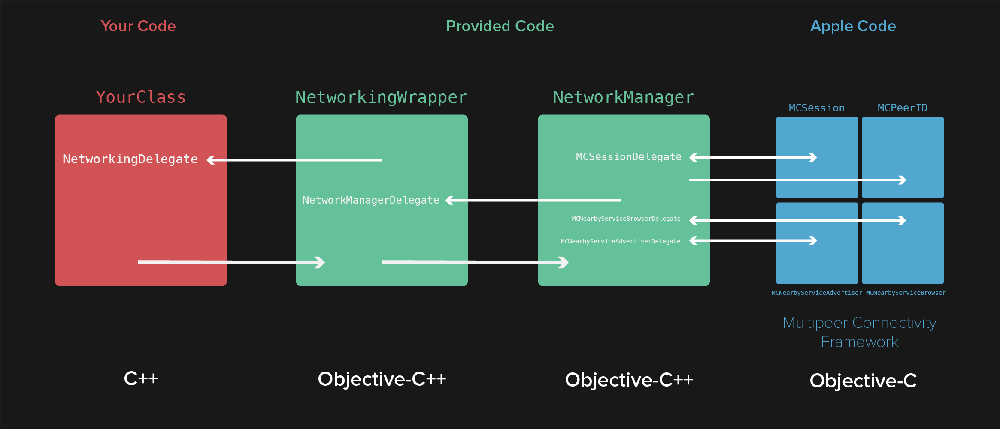

# MultipeerConnectivityCpp

A C++ wrapper for Apple's Multipeer Connectivity Framework

It abstracts away some potentially important features of Multipeer Connectivity, but it does provide a simple way to connect to a peer, and to send and recieve data.



# Interface

`NetworkingWrapper` is the class with which you can interface to use MultipeerConnectivity. It contains the following methods:
    
```C++
/**
 *  Set the name that will be used to advertise your networking service.
 *  It should be in the same format as a Bonjour service type: up to 15 characters long 
 *  valid characters include ASCII lowercase letters, numbers, and the hyphen.
 */
void setServiceName(const std::string& serviceName);
    
/**
 * The minimum number of peers the session should expect.
 */
void setMinimumPeers(unsigned int minimumPeers);
    
/**
 * The maximum number of peers the session should expect.
 */
void setMaximumPeers(unsigned int maximumPeers);

/**
 *  Set the delegate class that will be informed of connection state changes, and will be given the data recieved from the network
 */
void setDelegate(NetworkingDelegate* delegate);
    
/**
 *   Allow this device to be discovered and invited to connect by other devices
 */
void startAdvertisingAvailability();
    
/**
 *  Stop this device from being discoverable
 */
void stopAdvertisingAvailability();
    
/**
 *  Displays a built-in modal view that displays peers and allows this device to invite them to connect
 */
void showPeerList();
    
/**
 *  Sends the data in the specified address in memory with a given length over the network to the connected peers
 *  Mode options include reliable (probably, but not guaranteed to be TCP) and unreliable (probably but not guaranteed to be UDP)
 */
void sendData(const void* data, unsigned long length);
    
/**
 *  Retrieves the name of the this device
 */
static const char * getDeviceName();
    
/**
 *  Disconnect from the current session
 */
void disconnect();
    
/**
 *  Retrieves a list of the device names of any currently connected peers
 */
std::vector<std::string> getPeerList();
```
   
#NetworkingDelegate
    
To recieve data and be notified of connection status changes, you must implement the pure virtual functions of the `NetworkingDelegate` class. Then assign an instance of the class implementing `NetworkingDelegate` as a delegate of `NetworkingWrapper` using `void setDelegate(NetworkingDelegate* delegate)`.


```C++
virtual void receivedData(const void* data, unsigned long length);
virtual void stateChanged(ConnectionState state);
```